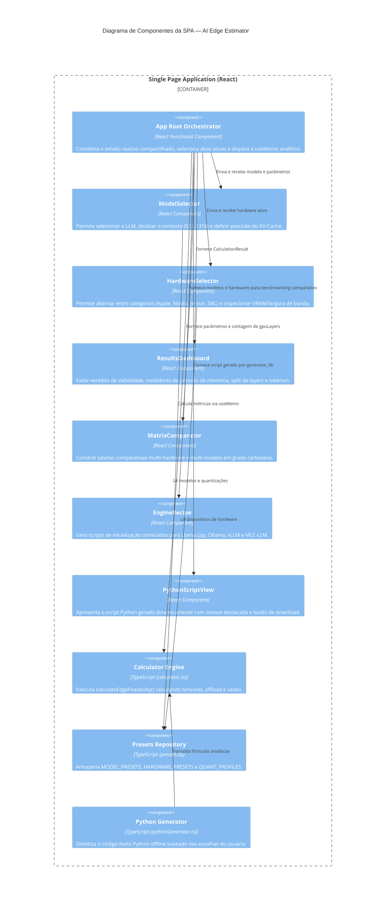

# Diagrama C4 — Componentes (Nível 3)

> Gerado pelo Arquiteto (Reversa v1.3.6) em 2026-10-28  
> Nível de Documentação: **Detalhado (3)**

```mermaid
C4Component
    title Diagrama de Componentes da SPA — AI Edge Estimator

    Container_Boundary(spa, "Single Page Application (React)") {
        Component(app_root, "App Root Orchestrator", "React Functional Component", "Coordena o estado reativo compartilhado, seleciona abas ativas e dispara o useMemo analítico.")
        
        Component(model_selector, "ModelSelector", "React Component", "Permite selecionar o LLM, deslizar o contexto (512-131k) e definir precisão do KV-Cache.")
        Component(hardware_selector, "HardwareSelector", "React Component", "Permite alternar entre categorias (Apple, Nvidia, Jetson, SBC) e inspecionar VRAM/largura de banda.")
        Component(results_dashboard, "ResultsDashboard", "React Component", "Exibe veredito de viabilidade, medidores de pressão de memória, split de layers e tokens/s.")
        Component(matrix_comparator, "MatrixComparator", "React Component", "Constrói tabelas comparativas multi-hardware e multi-modelo em grade cartesiana.")
        Component(engine_recipe, "EngineRecipe", "React Component", "Gera scripts de inicialização otimizados para Llama.cpp, Ollama, vLLM e MLC-LLM.")
        Component(python_view, "PythonScriptView", "React Component", "Apresenta o script Python gerado dinamicamente com sintaxe destacada e botão de download.")
        
        Component(calculator_lib, "Calculator Engine", "TypeScript (calculator.ts)", "Executa calculateEdgeFeasibility() calculando tensores, offload e vazão.")
        Component(presets_lib, "Presets Repository", "TypeScript (presets.ts)", "Armazena MODEL_PRESETS, HARDWARE_PRESETS e QUANT_PROFILES.")
        Component(generator_lib, "Python Generator", "TypeScript (pythonGenerator.ts)", "Sintetiza o código-fonte Python offline baseado nas escolhas do usuário.")
    }

    Rel(app_root, model_selector, "Envia e recebe modelo e parâmetros")
    Rel(app_root, hardware_selector, "Envia e recebe hardware ativo")
    Rel(app_root, calculator_lib, "Calcula métricas via useMemo")
    Rel(app_root, results_dashboard, "Fornece CalculationResult")
    Rel(app_root, matrix_comparator, "Fornece modelos e hardwares para benchmarking comparativo")
    Rel(app_root, engine_recipe, "Fornece parâmetros e contagem de gpuLayers")
    Rel(app_root, python_view, "Fornece script gerado por generator_lib")
    
    Rel(model_selector, presets_lib, "Lê modelos e quantizações")
    Rel(hardware_selector, presets_lib, "Lê dispositivos de hardware")
    Rel(generator_lib, calculator_lib, "Transpila fórmulas analíticas")
```
