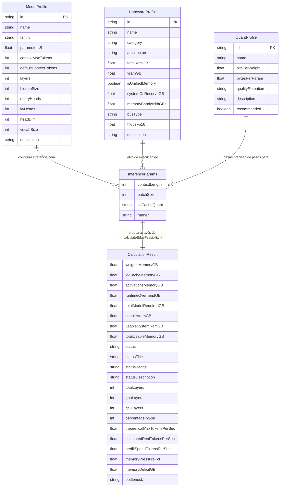

# Diagrama de Entidades e Relacionamentos (ERD) — ai-edge-estimator

> Gerado pelo Arquiteto (Reversa v1.3.6) em 2026-10-28  
> Nível de Documentação: **Detalhado (3)**

```mermaid
erDiagram
    ModelProfile ||--o{ InferenceParams : "configura inferência com"
    HardwareProfile ||--o{ InferenceParams : "alvo de execução de"
    QuantProfile ||--o{ InferenceParams : "define precisão de pesos para"
    
    ModelProfile {
        string id PK
        string name
        string family
        float parametersB
        int contextMaxTokens
        int defaultContextTokens
        int layers
        int hiddenSize
        int queryHeads
        int kvHeads
        int headDim
        int vocabSize
        string description
    }

    HardwareProfile {
        string id PK
        string name
        string category
        string architecture
        float totalRamGB
        float vramGB
        boolean isUnifiedMemory
        float systemOsReserveGB
        float memoryBandwidthGBs
        string busType
        float tflopsFp16
        string description
    }

    QuantProfile {
        string id PK
        string name
        float bitsPerWeight
        float bytesPerParam
        string qualityRetention
        string description
        boolean recommended
    }

    InferenceParams {
        int contextLength
        int batchSize
        string kvCacheQuant
        string runner
    }

    CalculationResult {
        float weightsMemoryGB
        float kvCacheMemoryGB
        float activationsMemoryGB
        float runtimeOverheadGB
        float totalModelRequiredGB
        float usableVramGB
        float usableSystemRamGB
        float totalUsableMemoryGB
        string status
        string statusTitle
        string statusBadge
        string statusDescription
        int totalLayers
        int gpuLayers
        int cpuLayers
        int percentageInGpu
        float theoreticalMaxTokensPerSec
        float estimatedRealTokensPerSec
        float prefillSpeedTokensPerSec
        float memoryPressurePct
        float memoryDeficitGB
        string bottleneck
    }

    InferenceParams ||--|| CalculationResult : "produz através de calculateEdgeFeasibility()"
```
