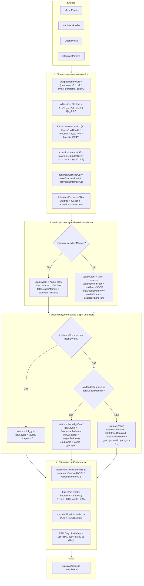

# Fluxograma — calculateEdgeFeasibility()

> Gerado pelo Arqueólogo (Reversa v1.3.6) em 2026-10-28  
> Nível de Documentação: **Detalhado (3)**

```mermaid
flowchart TD
    subgraph Entrada
        A1[ModelProfile]
        A2[HardwareProfile]
        A3[QuantProfile]
        A4[InferenceParams]
    end

    subgraph Calculo_Memoria [1. Dimensionamento de Memória]
        B1["weightsMemoryGB = (parametersB * 1e9 * bytesPerParam) / 1024^3"]
        B2["kvBytesPerElement = FP16: 2.0 | Q8_0: 1.0 | Q4_0: 0.5"]
        B3["kvCacheMemoryGB = (2 * layers * kvHeads * headDim * bytes * ctx * batch) / 1024^3"]
        B4["activationsMemoryGB = max(0.15, (hiddenSize * ctx * batch * 8) / 1024^3)"]
        B5["runtimeOverheadGB = baseOverhead + 0.4 * activationsMemoryGB"]
        B6["totalModelRequiredGB = weights + kvCache + activations + overhead"]
    end

    subgraph Hardware_Pool [2. Avaliação de Capacidade do Hardware]
        C1{"hardware.isUnifiedMemory?"}
        C2["usableVram = Apple: 90% livre | Outros: 100% livre\ntotalUsableMemory = totalRam - reserve"]
        C3["usableVram = vram - reserve\nusableSystemRam = totalRam - 3.5GB\ntotalUsableMemory = usableVram + usableSystemRam"]
    end

    subgraph Decisao_Offload [3. Determinação de Status e Split de Layers]
        D1{"totalModelRequired <= usableVram?"}
        D2["status = 'full_gpu'\ngpuLayers = layers, cpuLayers = 0"]
        D3{"totalModelRequired <= totalUsableMemory?"}
        D4["status = 'hybrid_offload'\ngpuLayers = floor((usableVram - ctxOverhead) / weightPerLayer)\ncpuLayers = layers - gpuLayers"]
        D5["status = 'oom'\nmemoryDeficitGB = totalModelRequired - totalUsableMemory\ngpuLayers = 0, cpuLayers = 0"]
    end

    subgraph Performance [4. Estimativa de Performance]
        E1["theoreticalMaxTokensPerSec = memoryBandwidthGBs / weightsMemoryGB"]
        E2["Full GPU: Real = theoretical * efficiency (Nvidia ~80%, Apple ~72%)"]
        E3["Hybrid Offload: limitada por PCIe (~45 GB/s max)"]
        E4["CPU Only: limitada por DDR RAM (55% de 30-65 GB/s)"]
    end

    subgraph Saida
        F1[CalculationResult consolidado]
    end

    Entrada --> Calculo_Memoria
    Calculo_Memoria --> Hardware_Pool
    C1 -- Sim --> C2
    C1 -- Não --> C3
    C2 --> Decisao_Offload
    C3 --> Decisao_Offload
    D1 -- Sim --> D2
    D1 -- Não --> D3
    D3 -- Sim --> D4
    D3 -- Não --> D5
    D2 --> Performance
    D4 --> Performance
    D5 --> Performance
    Performance --> Saida
```
