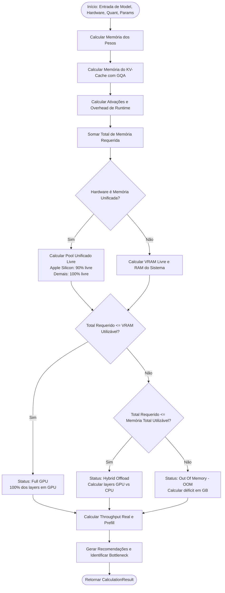

# Fluxograma — Módulo Calculator

> Gerado pelo Arqueólogo (Reversa v1.3.6) em 2026-10-28

```mermaid
flowchart TD
    Start([Início: Entrada de Model, Hardware, Quant, Params]) --> CalcWeights[Calcular Memória dos Pesos]
    CalcWeights --> CalcKV[Calcular Memória do KV-Cache com GQA]
    CalcKV --> CalcActivations[Calcular Ativações e Overhead de Runtime]
    CalcActivations --> SumTotalReq[Somar Total de Memória Requerida]
    
    SumTotalReq --> CheckArch{Hardware é Memória Unificada?}
    CheckArch -- Sim --> CalcUnifiedPool[Calcular Pool Unificado Livre\nApple Silicon: 90% livre\nDemais: 100% livre]
    CheckArch -- Não --> CalcDiscretePool[Calcular VRAM Livre e RAM do Sistema]
    
    CalcUnifiedPool --> EvalFeasibility
    CalcDiscretePool --> EvalFeasibility{Total Requerido <= VRAM Utilizável?}
    
    EvalFeasibility -- Sim --> StatusFullGPU[Status: Full GPU\n100% dos layers em GPU]
    EvalFeasibility -- Não --> CheckTotalPool{Total Requerido <= Memória Total Utilizável?}
    
    CheckTotalPool -- Sim --> StatusHybrid[Status: Hybrid Offload\nCalcular layers GPU vs CPU]
    CheckTotalPool -- Não --> StatusOOM[Status: Out Of Memory - OOM\nCalcular déficit em GB]
    
    StatusFullGPU --> PerfBandwidth[Calcular Throughput Real e Prefill]
    StatusHybrid --> PerfBandwidth
    StatusOOM --> PerfBandwidth
    
    PerfBandwidth --> GenRecommendations[Gerar Recomendações e Identificar Bottleneck]
    GenRecommendations --> ReturnResult([Retornar CalculationResult])
```
